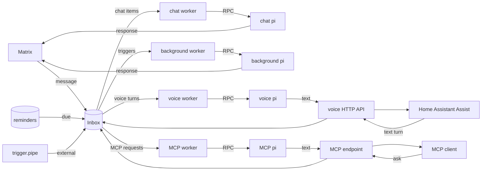

# OpenCrow

A saner alternative to [OpenClaw](https://github.com/openclaw/openclaw).

  

## Fork notes

This is a fork of [pinpox/opencrow](https://github.com/pinpox/opencrow).
Upstream is built around one-on-one chat. This fork is built for group chats,
where most messages aren't meant for the bot.

I started by removing everything I didn't use: the Nostr and Signal backends,
the backend abstraction, the heartbeat, the memory extension, and the bundled
skills. Matrix is the only transport. Then I added back what group chats need:

- Prompts include the time, sender, and room, and the bot can join several
  rooms and post to any of them.
- An optional script decides which group messages go to the agent (see
  [Group message routing](docs/configuration.md#group-message-routing)).
  Skipped messages are saved and handed to the agent the next time it's
  addressed.
- The agent can react instead of replying, or answer `NO_REPLY` to stay quiet.
- Reminders and trigger pipes run in their own Pi session, separate from chat.
  Recurring cron reminders replace the heartbeat.

There's also a Home Assistant voice API and an MCP endpoint, each with its own
Pi session.

Upstream has moved on since the fork. It now runs
[omp](https://github.com/can1357/oh-my-pi) instead of pi, and adds a local
socket backend and Matrix password login. None of that is here.

## README

OpenCrow is a Matrix bot that bridges chat messages to
[pi](https://github.com/badlogic/pi-mono), a coding agent with built-in tools,
session persistence, auto-compaction, and multi-provider LLM support. Instead of
reimplementing all of that in Go, OpenCrow spawns pi as a long-lived subprocess
via its RPC protocol and acts as a thin bridge. By default, the bot behaves as
a chat agent plus a separate background agent for reminders and external
triggers. It can also expose an authenticated text-turn API for use as a Home
Assistant conversation agent, backed by a third Pi session, and an MCP endpoint
that lets another AI assistant hand requests to a fourth.

Setting `OPENCROW_MATRIX_ROOM_ID` gives background work and voice file delivery
a stable default room, and enables multi-room invite handling.

The Go service receives Matrix messages, optional HTTP voice turns, and optional
MCP requests, forwards them to the appropriate Pi process, and routes the
response back to the original transport.

> [!WARNING]
> There is no whitelisting, permission system, or tool filtering. Trying to bolt
> that onto LLM tool use is inherently futile — the model will find a way around
> it. The only real protection is running OpenCrow in a containerized or sandboxed
> environment. **Use a NixOS container, VM, or similar isolation.** The included
> NixOS module does exactly that. Don't run it on a machine where you'd mind the
> LLM running arbitrary commands.

## Documentation

- **[Tutorial](docs/tutorial.md)** — Step-by-step NixOS deployment with Matrix
- **[Configuration](docs/configuration.md)** — Environment variables, Matrix settings, secrets, and authentication
- **[Home Assistant voice assistant](docs/voice-assistant.md)** — HTTP text turns, the dedicated voice session, and Assist setup
- **[MCP endpoint](docs/mcp.md)** — Letting another AI assistant, such as LibreChat, hand requests to OpenCrow
- **[Skills](docs/skills.md)** — Teaching the agent new capabilities via markdown instructions
- **[Extensions](docs/extensions.md)** — TypeScript lifecycle hooks and custom tools
- **[Reminders](docs/reminders.md)** — One-shot reminders, recurring schedules, and trigger pipes
