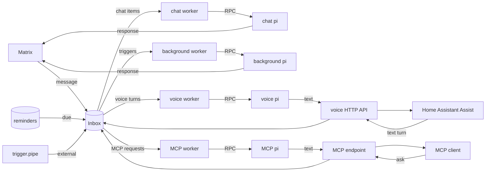

# Barnaby

Barnaby is a Matrix bot that puts an AI agent in your group chats. It's built
for rooms where most messages aren't meant for the bot: it reads along, records
what it skipped in its session, and answers when someone addresses it.

The agent is [pi](https://github.com/badlogic/pi-mono), a coding agent with
built-in tools, session persistence, auto-compaction, and multi-provider LLM
support. Barnaby doesn't reimplement any of that. It runs pi as a long-lived
subprocess over its RPC protocol and handles the chat side.

## Features

- Prompts include the time, sender, and room. The bot can join several rooms
  and post to any of them.
- An optional script decides which group messages go to the agent (see
  [Group message routing](docs/configuration.md#group-message-routing)).
  Skipped messages are recorded in the chat session without calling the
  model, so the agent has them the next time it's addressed.
- The agent can react instead of replying, or answer `NO_REPLY` to stay quiet.
- One-shot reminders, recurring cron reminders, and external trigger pipes run
  in their own Pi session, separate from chat.
- A Home Assistant voice API and an MCP endpoint let Assist or another AI
  assistant hand requests to Barnaby, each with its own Pi session.

Matrix is the only chat transport.

## How It Works

Barnaby runs a chat agent plus a separate background agent for reminders and
external triggers. It can also expose an authenticated text-turn API for use as
a Home Assistant conversation agent, backed by a third Pi session, and an MCP
endpoint that hands requests to a fourth.

Setting `BARNABY_MATRIX_ROOM_ID` gives background work and voice file delivery
a stable default room, and enables multi-room invite handling.

The Go service receives Matrix messages, optional HTTP voice turns, and optional
MCP requests, forwards them to the appropriate Pi process, and routes the
response back to the original transport.

> [!WARNING]
> There is no whitelisting, permission system, or tool filtering. Trying to bolt
> that onto LLM tool use is inherently futile — the model will find a way around
> it. The only real protection is running Barnaby in a containerized or sandboxed
> environment. **Use a NixOS container, VM, or similar isolation.** The included
> NixOS module does exactly that. Don't run it on a machine where you'd mind the
> LLM running arbitrary commands.

## Documentation

- **[Tutorial](docs/tutorial.md)** — Step-by-step NixOS deployment with Matrix
- **[Configuration](docs/configuration.md)** — Environment variables, Matrix settings, secrets, and authentication
- **[Home Assistant voice assistant](docs/voice-assistant.md)** — HTTP text turns, the dedicated voice session, and Assist setup
- **[MCP endpoint](docs/mcp.md)** — Letting another AI assistant, such as LibreChat, hand requests to Barnaby
- **[Skills](docs/skills.md)** — Teaching the agent new capabilities via markdown instructions
- **[Extensions](docs/extensions.md)** — TypeScript lifecycle hooks and custom tools
- **[Reminders](docs/reminders.md)** — One-shot reminders, recurring schedules, and trigger pipes
- **[Memory](docs/memory.md)** — Nightly notes from past conversations, and how the agent searches them

## Origins

Barnaby started in April 2026 as a fork of
[pinpox/opencrow](https://github.com/pinpox/opencrow), which is built around
one-on-one chat. It's developed independently now and doesn't track upstream.
