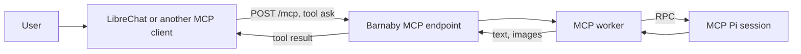

# MCP endpoint

Barnaby can expose itself as a tool to another AI assistant through the
[Model Context Protocol](https://modelcontextprotocol.io/). The other assistant,
such as LibreChat, hands Barnaby a plain-language request and gets a text reply,
plus any images, back. Barnaby runs the request through a dedicated Pi session with its normal
tools and skills.



The endpoint is disabled by default. Enabling it adds a fourth worker alongside
chat, background, and voice. The MCP worker uses the normal provider, model,
soul, working directory, skills, and tools, but keeps its own conversation
context. There is no restricted MCP permission profile.

Like the voice API, this is an addition to the Matrix bot. Matrix configuration
is still required, and Matrix is used to stop a stuck request and to receive
messages or files the agent was asked to send there.

## Enable the endpoint

The MCP endpoint is served at `/mcp` on the same listener as the
[voice API](voice-assistant.md), so it needs `BARNABY_HTTP_LISTEN` and
`BARNABY_HTTP_BEARER_TOKEN` as well as its own token:

```nix
services.barnaby.instances.barnaby = {
  environment.BARNABY_HTTP_LISTEN = "0.0.0.0:8787";
  environmentFiles = [
    /run/secrets/barnaby-env
  ];
};
```

The environment file holds both tokens. Use a different long random value for
each:

```text
BARNABY_HTTP_BEARER_TOKEN=replace-with-a-random-secret
BARNABY_MCP_BEARER_TOKEN=replace-with-another-random-secret
```

You can generate them with:

```bash
openssl rand -hex 32
```

Barnaby refuses to start if `BARNABY_MCP_BEARER_TOKEN` is set without
`BARNABY_HTTP_LISTEN`. The voice token does not grant MCP access, and the MCP
token does not grant voice access.

| Variable | Default | Description |
|---|---|---|
| `BARNABY_MCP_BEARER_TOKEN` | _(empty)_ | Bearer token required by `/mcp`. Setting it enables the endpoint. |
| `BARNABY_MCP_SESSION_DIR` | `<tmpdir>/barnaby-mcp` | Directory for MCP Pi session files |

## Protocol

`/mcp` speaks stateless Streamable HTTP. Every POST is a complete request with
a plain JSON response; there are no MCP sessions and no server-sent event
streams. Clients send the token as usual:

```text
Authorization: Bearer <BARNABY_MCP_BEARER_TOKEN>
```

Two optional headers tell Barnaby who the request is for:

| Header | Description |
|---|---|
| `X-Barnaby-User` | The user the calling assistant is acting for, such as an email address |
| `X-Barnaby-Conversation` | The calling assistant's conversation ID |

Barnaby treats both as opaque strings. Each is limited to 1 KiB of valid UTF-8.
They're passed to the model as trusted context and select the Pi session (see
below).

## The ask tool

The server offers exactly one tool, `ask`:

```json
{ "request": "What's on my calendar tomorrow?" }
```

`request` is required. Leading and trailing whitespace is removed, and it is
limited to 16 KiB of valid UTF-8. The result is a text content block with
Barnaby's reply, followed by an image content block for each image it returns
(see [Files](#files)). The text block is left out when the reply is only images.

The tool description tells the calling model what Barnaby can do. It starts
with a short generic introduction and then lists each loaded skill's `name` and
`description` from the YAML frontmatter in its `SKILL.md`. A skill without a
`name` is listed by its directory name. Skills are read once at startup.

Failures come back as MCP tool errors (`isError: true`) with a short message:

| Message | Meaning |
|---|---|
| `Barnaby is already handling too many MCP requests. Try again shortly.` | One request is active and four more are already queued |
| `The request took too long.` | The request exceeded its 5-minute deadline |
| `The request was cancelled.` | The request was stopped with `!mcp-stop` |
| `Barnaby could not complete the request.` | Pi or the configured model provider failed |
| `Barnaby is shutting down.` | Barnaby stopped before the request finished |

## Sessions

Requests with the same user and conversation share a Pi session, so follow-up
questions keep their context. The session key is:

- user and conversation, when both headers are present
- the user alone, when there is no conversation header
- one shared session, when neither header is present

A session is reused while it has been used within the last 30 minutes. After
that, the next request for the same key starts a new session. Barnaby keeps the
mapping from keys to session files in memory only, so a restart starts every
key fresh.

Session files are written to `BARNABY_MCP_SESSION_DIR`. Barnaby never deletes
them; the default temp directory is left to normal `/tmp` cleanup. The MCP Pi
process is stopped after the normal idle timeout, but it is never compacted
while idle.

## Queue and deadline

MCP requests are serialized through one Pi process. Barnaby accepts at most
five pending requests: one active request and four queued ones. The 5-minute
deadline starts when the request is accepted, so time spent waiting in the
queue counts against it. Set the client's timeout to at least 5 minutes.

If the HTTP client disconnects, Barnaby removes the queued request or cancels
the active Pi turn. MCP queue rows are discarded at startup, so a request is
never replayed after a Barnaby restart.

## Files

A `<sendfile>/absolute/path</sendfile>` tag without `<send-to>` returns the file
to the calling assistant as MCP image content. LibreChat, for example, shows it
to the user as an attachment and passes it to its model.

Only PNG, JPEG, GIF, and WebP images up to 10 MiB can be returned. The type is
detected from the file's contents, not its name. MCP clients have no general way
to show other files, so for anything else the reply text gets a short note, such
as `(report.pdf could not be returned: only PNG, JPEG, GIF, and WebP images can be
returned.)`, and the agent is told to share a link instead.

Files only go one way. A tool call carries the arguments the calling model
writes, so a client can't pass the user's uploads to `ask`. Public URLs in the
request work as usual.

## Matrix delivery from MCP

Normal replies and files go only to the calling assistant. The MCP Pi session
can still use Barnaby's response control tags:

- `<send-to>ROOM_ID</send-to>` sends the remaining response and any files to the
  selected Matrix room. The calling assistant receives a short acknowledgement
  instead.
- `<react>` tags are removed and ignored because an MCP request has no source
  Matrix event to react to.

## Manage MCP requests from Matrix

| Command | Description |
|---|---|
| `!mcp-stop` | Abort the active MCP request; queued requests remain queued |

## Security and privacy

Treat the MCP token as full access to the Barnaby instance. The MCP worker
inherits the normal tools and skills, and Barnaby does not apply a permission
layer based on `X-Barnaby-User` or anything else. The headers are trusted as
sent by the client; anyone with the token can claim to be any user and read or
continue that user's recent session.

Keep the endpoint on a trusted network or put it behind an authenticated TLS
reverse proxy. Don't expose the plain HTTP listener directly to the internet.

The MCP SDK's DNS rebinding protection rejects requests that reach Barnaby on
a loopback address with a non-loopback `Host` header, with `403 Forbidden`. A
reverse proxy on the same host that forwards to `127.0.0.1` must send a
loopback `Host` header, such as `localhost:8787`, to `/mcp`.

At info level, Barnaby logs the request's user and conversation headers but
not the request text. Full request text is logged at debug level.

## LibreChat example

Add Barnaby to `librechat.yaml` under `mcpServers`:

```yaml
mcpServers:
  barnaby:
    type: streamable-http
    url: http://barnaby.example.test:8787/mcp
    headers:
      Authorization: 'Bearer ${BARNABY_MCP_BEARER_TOKEN}'
      X-Barnaby-User: '{{LIBRECHAT_USER_EMAIL}}'
      X-Barnaby-Conversation: '{{LIBRECHAT_BODY_CONVERSATIONID}}'
    timeout: 300000
    requiresOAuth: false
```

Put `BARNABY_MCP_BEARER_TOKEN` in LibreChat's environment. With these headers,
each LibreChat conversation gets its own Barnaby session, and Barnaby knows
which LibreChat user it is working for.
